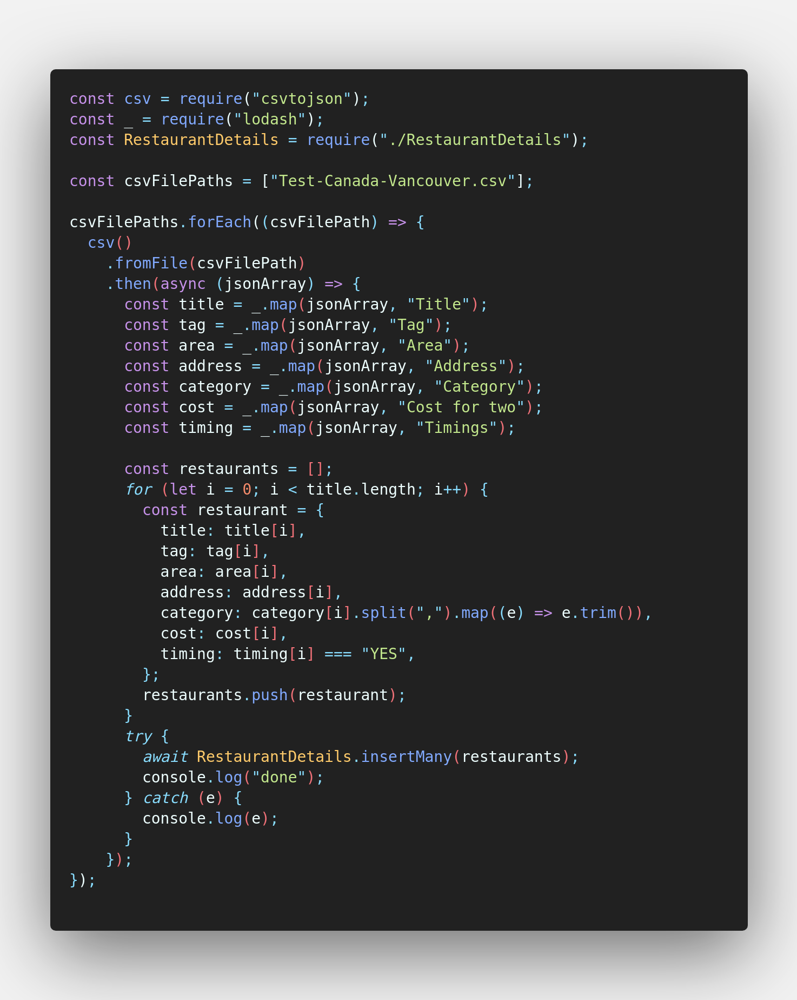

# Food Search

Its an a web application.

## Feature List

-   Infinite Scrolling
-   Query Based Search

## Getting Started

-   First thing, just clone the repo.
-   Make sure you're in master branch
-   Create the .env files

## .env Files

-   In frontend folder create file named `.env`
    -   with this content
    ```
    PORT=5000
    REACT_APP_BACKEND_URL=http://localhost:3000
    ```
-   In backend folder create file named `.env`
    -   with this content
    ```
    PORT=3000
    MONGO_DB_URI=mongodb://127.0.0.1:27017/food-search
    ```

### Project Structure

The root folder contains our:

-   frontend
-   backend
-   git operations

## Installation (Frontend + Backend)

First, run npm install command in the root directory so that concurrently will be installed in your repository.

```
npm install
```

Install the frontend and backend dependencies

```
cd backend
npm i
cd ../frontend
npm i
```

## Running App (Frontend + Backend)

Make sure you are in root folder and just run the following command. It will start front-end and back-end with a single script.

```
npm run start
```

## Technical Details

> The dataset is been pushed with this set of code
> 

## Happy coding
